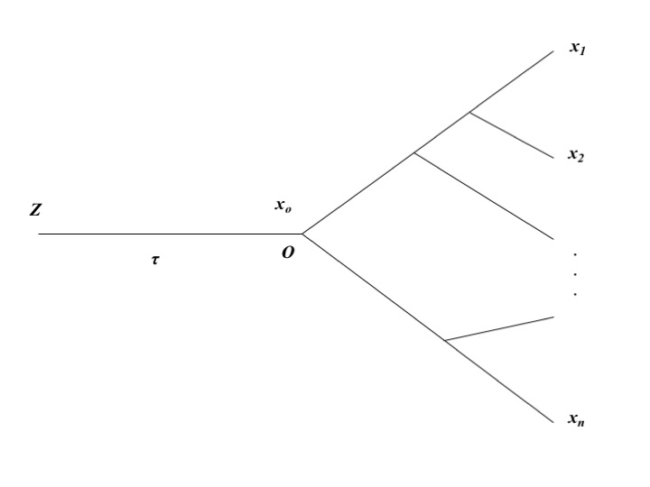

---
output:
  pdf_document: default
  html_document: default
---
# Estimating the Strength of Expression Conservation
## Theory
### Stabilizing selection model in transcriptome evolution across species
The Ornstein-Uhlenbeck (OU) model, which claims that expression changes are constrained by the stabilizing selection, is biologically more realistic than a simple Brownian motion (BM) model[@rohlfs2014@lemos2005@gu2007@bedford2009@brawand2011].

Intuitively speaking, the OU model includes two opposite processes: 

* random mutations push the expression level ($x$) of a gene away from the optimum ($\mu$), a process may suffer from a fitness reduction;
* the return process to the expression optimum ($\mu$) driven by a positive selection; the strength of this ‘elastic’ return increases proportionally with w, the coefficient of stabilizing selection. Given the initial expression value ${x_0}$, the OU model predicts that $x\left(t\right)$, the expression level after $t$ evolutionary time units, follows a normal distribution with the mean $E\left[x\ \mid\ x_0\right]$ and variance $V\left[x\ \mid\ x_0\right]$ 

$$
\begin{split}
E\left[x\ \mid\ x_0\right]\ &=\ \mu\left(1-e^{-\beta t}\right)\ +\ z_0e^{-\beta t} \\
V\left[x\ \mid\ x_0\right]\ &=\frac{1-e^{-2\beta t}}{W}
\end{split}\tag{3.1}
$$

respectively, where $\beta$ is the rate of expression evolution and W is the strength of expression  conservation; symbolically one may write  an OU process by $OU\left(x\ \mid\ x_0;\ \theta\right)$, where $\theta\ =\ \left(\mu,\ \beta t,\ W\right)$ is the parameter vector. 


###  Stationary OU model under a species phylogeny
We shall develop a statistical method to estimate the strength ($W$) of expression conservation of a gene from high throughput RNA-seq data of multiple species. **Figure 6.1** illustrates the evolutionary scenario used in the evolutionary transcriptome analysis. 

* The first component is the evolutionary lineage from the origin of the tissue (node $Z$) to the root (node $O$) of the species phylogeny, with $\tau$ evolutionary time units. 
* The second component is the conventional species phylogeny with $n$ species. That is, given the initial expression value $z_0$ at node $Z$, the OU process of $x_0$ in the lineage from $Z$ to $O$ is given by $OU\left(x_0\mid z_0;\ \theta\right)$, where the parameter vector $\theta=\left(\mu,\ \beta\tau,\ W\right)$.  The joint density of expressions $\boldsymbol{x}=\left(x_1,...x_n\right)$ conditional of the expression level ($x_0$) at root $O$, denoted by $P\left(\boldsymbol{x}\mid x_0\right)$, can be derived under the OU model. It follows that the joint expression density of $\boldsymbol{x}=\left(x_1,...x_n\right)$ conditional of $z_0$ is given by

$$P\left(\boldsymbol{x}\mid z_0\right)=\int_{\ -\infty}^{\infty}OU\left(x_0\mid z_0;\ \tau\right)P\left(\boldsymbol{x}\mid x_0\right)dx_0\tag{3.2}$$
[@hansen1996] showed that either $P\left(\boldsymbol{x}\mid x_0\right)$ or $P\left(\boldsymbol{x}\mid z_0\right)$ is multivariate normally distributed. Consider $P\left(\boldsymbol{x}\mid z_0\right)\sim N\left(\boldsymbol{x}; \boldsymbol{\mu}, \boldsymbol{V}\right)$ at first, where $\boldsymbol{\mu}$ is the mean vector and $\boldsymbol{V}$ is the variance-covariance matrix. Because current transcriptome data contain little information about the evolution from node $Z$ to node $O$, calculations of $\boldsymbol{\mu}$ and $\boldsymbol{V}$ are usually difficult because both depend on $z_0$ and $\tau$.

We propose a stationary OU model (sOU) that helpful to avoid these problems in practice, which postulates that, at the genome-wide level, the biological function of a tissue-specific transcriptome is conservative during the course of species evolution. Specifically, sOU involves two assumptions. 

* Origin of the tissue (node $Z$ in **Figure 6.1**) was so ancient that the evolutionary time between nodes $Z$ and $O$ can be approximated by $\tau \to \infty$. Consequently, the expression mean and variance at root $O$ approach to $\mu$ and $\rho^{2} = 1/W$, respectively.
* The optimal expression level ($\mu$) and the strength of expression conservation ($W$) remain virtually constant along the species phylogeny, that is, the expression mean and variances at all internal and external nodes are equal to $\mu$ and $1/W$, respectively. 

Under the stationary OU model, $P\left(\boldsymbol{x}\mid z_0\right)$ can be simplified as follows: 

* $P\left(\boldsymbol{x}\mid z_0\right)$ is independent of $z_0$; 
* the mean vector $\boldsymbol{\mu}$ is uniform, i.e., $\mu_1=...\mu_n$; 
* the variance-covariance matrix is simply given by $\boldsymbol{V}=\boldsymbol{R}/W$, where $\boldsymbol{R}$ is the coefficient of correlation matrix. Our intent is to estimate the strength of expression conservation of a gene, characterized by a single parameter $W$. In this sense, the joint density of $\boldsymbol{x}$ can be symbolically written by $P\left(\boldsymbol{x};\boldsymbol{\mu},\boldsymbol{R},W\right)$. Together, we have 

$$P\left(\boldsymbol{x}\mid x_0\right)=P\left(\boldsymbol{x}\mid z_0\right)\sim P\left(\boldsymbol{x};\ \boldsymbol{\mu},\ \boldsymbol{R},\ W\right)=N\left(\boldsymbol{x};\ \boldsymbol{\mu},\ \boldsymbol{R}/W\right)\tag{3.3}$$


```{r pressure, echo=FALSE, fig.cap="The evolutionary scenario for comparative transcriptome analysis", out.width = '50%'}

```

### Variation of $W$ among genes
The sOU model assumes that the strength of expression conservation ($W$) of a gene remains a constant in species evolution but differs among genes. Substantial evidence has supported this argument[@bedford2009@brawand2011@cui2007@park2013@tirosh2006@warnefors2012@zou2011]. Further, we model $W$ as a random variable that varies among genes according to a gamma distribution, that is,

$$\phi\left(W;\alpha,\overline{W}\right)=\frac{(\alpha/\overline{W})^\alpha}{\Gamma\left(\alpha\right)}W^{\alpha-1}e^{-\alpha W/\overline{W}}\tag{3.4}$$
where $\overline{W}$ is the mean and $\alpha$ is the shape parameter; a small values of $\alpha$ means a high degree of $W$-variation, and $\alpha = \infty$ means a constant $W$ among genes. After rewriting the joint normal density $P\left(\boldsymbol{x};\ \boldsymbol{\mu},\ \boldsymbol{R},\ W\right)$ by $P\left(\boldsymbol{x}\mid W;\ \boldsymbol{\mu},\ \boldsymbol{R},\right)$ to indicate $W$ is a random variable, we have 
$$P\left(\boldsymbol{x}\mid W;\ \boldsymbol{\mu},\ \boldsymbol{R},\right)=N\left(\boldsymbol{x};\ \boldsymbol{\mu},\ \boldsymbol{R}/W\right)\tag{3.5}$$
It follows that the marginal density of $\boldsymbol{x}$ is given by
$$
\begin{split}
P\left(\boldsymbol{x};\boldsymbol{\mu},\boldsymbol{R},\alpha,\overline{W}\right)&=\int_0^{\infty}P\left(\boldsymbol{x}|W;\ \boldsymbol{\mu};\boldsymbol{R}\right)\phi\left(W;\ \alpha,\overline{W}\right)dW\\
&=A\left(\frac{\overline{W}}{\alpha}\right)^{n/2}\left(\frac{\Gamma\left(n/2+\alpha\right)}{\Gamma\left(\alpha\right)}\right)\left(\frac{\alpha}{\alpha+Q\left(\boldsymbol{x}\right)\overline{W}}\right)^{n/2+\alpha}
\end{split}\tag{3.6}
$$
where $Q\left(\boldsymbol{x}\right)=\left(\boldsymbol{x}-\boldsymbol{\mu}\right)^T\boldsymbol{R}^{-1}\left(\boldsymbol{x}-\boldsymbol{\mu}\right)$ is a quadratic function of $\boldsymbol{x}$, and $A=\pi^{-\frac{n}{2}}\left|\boldsymbol{R}\right|^{-\frac{1}{2}}$ is a normalization constant.

### An empirical Bayesian framework for gene-specific $W$ esitimation
#### Posterior mean of W as gene-specific predictor
We adopt an empirical Bayesian procedure to predict the strength of expression conservation for single gene. By the Bayes rule, the posterior density of $W$ conditional of the expression profile ($\boldsymbol{x}$) of a gene is given by

$$P\left(W \mid \boldsymbol{x};\boldsymbol{\mu},\boldsymbol{R},\alpha,\overline{W} \right) =\frac{\phi\left(W;\alpha,\overline{W}\right)P\left(\boldsymbol{x}|W;\boldsymbol{\mu},\boldsymbol{R}\right)}{P\left(\boldsymbol{x};\boldsymbol{\mu},\boldsymbol{R},\alpha,\overline{W}\right)}\tag{3.7}$$
After some mathematical calculations, one can show that the analytical form of the posterior density of $W$ is given by
$$P\left(W \mid \boldsymbol{x};\boldsymbol{\mu},\boldsymbol{R},\alpha,\overline{W} \right) = A\left(\frac{\overline{W}}{\alpha}\right)^{n/2}\left(\frac{\Gamma\left(n/2+\alpha\right)}{\Gamma\left(\alpha\right)}\right)\left(\frac{\alpha}{\alpha+Q\left(\boldsymbol{x}\right)\overline{W}}\right)^{n/2+\alpha}\tag{3.8}$$
Hence, $P\left(W \mid \boldsymbol{x};\boldsymbol{\mu},\boldsymbol{R},\alpha,\overline{W} \right)$ follows a gamma distribution, with the mean and variance given by 
$$
\begin{split}
E\left[W|\boldsymbol{x}\right]\ &=\left[\frac{\alpha+\frac{n}{2}}{\alpha+Q\left(x\right)\overline{W}}\right]\overline{W}\\
Var\left[W|\boldsymbol{x}\right]&=\left[\frac{\alpha+\frac{n}{2}}{\left(\alpha+Q\left(x\right)\overline{W}\right)^2}\right](\overline{W})^2
\end{split}\tag{3.9}
$$

respectively. Of particular, the posterior mean, $E\left[W|\boldsymbol{x}\right]$ can be used  as the predictor for the strength of expression conservation of a gene with obseved expression profile $\boldsymbol{x}$.

#### Relative strength of expression conservation
 It has been realized that the strenth of expression conservation ($W_k$) of gene $k$ highly depends on the normalization method used for RNA-seq raw reads count. Hence, it is difficult to compare between two sets of estimates when they used different normalization methods. To aleviate this problem, it is more convenient to use the ratio $U_k=W_k/\overline{W}$, the relative strength of expression conservation. Suppose we have $N$ orthologous genes under study, and the expression profile of the $k$-th gene is denoted by $\boldsymbol{x}_k$, $k=1,…N$. Let $W_{k}=E\left[W|\boldsymbol{x}\right]$ be the posterior predictor for the strength of expression conservaton of gene $k$.  Notice that the expectation of  the posterior mean prediction ($E\left[W|\boldsymbol{x}\right]$) with respect to the the maginal density $P\left(\boldsymbol{x};\boldsymbol{\mu},\boldsymbol{R},\alpha,\overline{W}\right)$ is  equal to the mean of the strength of expression conservation ($\overline{W}$), that is, 

$$\int E\left[W\mid \boldsymbol{x}\right]P\left(\boldsymbol{x};\ \boldsymbol{\mu},\ \boldsymbol{R},\ \alpha,\ \overline{W}\right)d\boldsymbol{x}=\overline{W}\tag{3.10}$$
Eq.(3.10) implies that the averge of $U_k$, the relative strength of expression conservation over all genes is roughly to be one, that is,  
$$\frac{\sum_{k=1}^NU_k}{N}\approx1\tag{3.11}$$
\newpage

## Statistical Procedure
Suppose that we have RNA-seq datasets of a particular tissue from $n$ species, and the expression profile of each $k$-th gene denoted by $\boldsymbol{x_k}=\left(x_{1k,\ }...x_{nk}\right)$, $k=1...,N$. We developed a practically feasible procedure to estimate $W$ of each gene, which actually deals with the quadratic function of $\boldsymbol{x_{k}}$, or $Q\left(\boldsymbol{x_k}\right)$. The procedure is briefly described below. 

1. Calculate gene-$k$ specific mean ($\mu_{k}$) by a simple average over orthologous genes. 
2. Calculate the matrix of correlation coefficients ($\boldsymbol{R}$) from comparative RNA-seq data, which is applied to each of gene. 
3. Calculate the quadratic function of each gene $k$, $Q\left(x_k\right)$, by 
$$\hat{Q}\left(x_k\right)=\sum_{_{i=1}}^n\sum_{j=1}^nc_{ij}\left(x_{ik}-\mu_k\right)\left(x_{jk}-\mu_k\right)\tag{3.12}$$
where $c_{ij}$ is the $ij$-th element of matrix $\boldsymbol{C}=\boldsymbol{R}^{-1}$, $x_{ik}$ or $x_{jk}$ is the expression value of gene $k$ in species $i$ or $j$, respectively. 
4. Treating $Q\left(\boldsymbol{x_k}\right)$ as the observation of gene $k$ and rewriting  Eq.(6), symbolically, by $P\left(Q\left(\boldsymbol{x_k}\right);\alpha,\ \overline{W}\right)$, build up an approximate likelihood function 
$$\ell\left(X \ \mid \ \alpha,\ \overline{W}\right)\ =  \prod_{k=1}^NP\left(\hat{Q}\left(\boldsymbol{x_k}\right);\ \alpha,\overline{W}\right)$$
and obtain the maximum likelihood estimates (MLE) of $\alpha$ and $\overline{W}$; the standard likelihood ratio test is applied to test the null hypothesis of no $W$-variation among genes, i.e., $\alpha = \infty$.
5. Calculate $W_{k}$, the empirical Bayesian estimate of the strength of expression conservation of gene $k$, from Eq.(3.9) after replacing $\alpha$ and $\overline{W}$ by their estimates. 

\newpage

## Case Study: Emprical Bayesian Esitimates of Expression Conservation of genes
We use the expression values of 5635 1:1 orthologous genes in brain of nine mammalian species to estimate the parameters of the selection pressure gamma distribution in brain. Then we estimate the gene-specific selection pressure based on Bayes' theorem.

*TreeExp* can be loaded the package in the usual way:

```{r, eval=FALSE}
library('TreeExp')
```

Let us first load the tetrapod expression dataset:

```{r, warning = FALSE, message = FALSE}
data('tetraExp')
```

### Inversed correlation matrix

And then, based on the constructed *taxaExp* object, we are going to create an inverse correlation matrix between mammalian species from the *taxaExp* object:

```{r, warning = FALSE, message = FALSE}

species.group <- c("Human", "Chimpanzee", "Bonobo", "Gorilla",
"Macaque", "Mouse", "Opossum", "Platypus")
### all mammalian species

inv.corr.mat <- corrMatInv(tetraExp, taxa = species.group, subtaxa = "Brain")
inv.corr.mat
```

### Estimation of gamma parameters

Then we need to extract the expression values of orthologous genes from the *taxaExp* object using `exptabTE` function.

```{r, warning = FALSE, message = FALSE}
brain.exptable <- exptabTE(tetraExp, taxa = species.group, subtaxa = "Brain" ,logrithm = TRUE)
head(brain.exptable)
```

With the inverse correlation matrix and expression values of brain tissue in 9 mammals, we are now able to estimate the parameters of the gamma distribution:

```{r, warning = FALSE, message = FALSE}
gamma.paras <- estParaGamma(exptable =brain.exptable, corrmatinv =inv.corr.mat)
## print the elements of gamma.paras
gamma.paras
```

The $\bar{W}$ is the average of the selection pressure levels in the tissue brain. 
And the shape parameter $\alpha$ here can reflect the internal variances of selection pressure. The more close $\alpha$ is to 2, the more distinctive selection pressures on genes. And if the $\alpha$ is close to infinite, it means there are no difference among selection pressures on genes.

### Bayesian estimation of gene-specific selection pressure

After parameters of the gamma distribution are estimated, we are able to estimate posterior selection pressures as well as their *se* with given 'RPKM' values across species:

```{r, warning = FALSE, message = FALSE}
brain.Q <- estParaQ(brain.exptable, corrmatinv = inv.corr.mat)
# with prior expression values and inversed correlation matrix
    
brain.post<- estParaWBayesian(brain.Q, gamma.paras)
brain.W <- brain.post$w # posterior selection pressures
brain.CI <- brain.post$ci95 # posterior expression 95% confidence interval

```
After esitimating the Bayesian selection pressres, $W$, we can chek a few gene with hightest selection pressure.
```{r}
names(brain.W) <- rownames(brain.exptable)
head(sort(brain.W, decreasing = TRUE)) #check a few genes with highest seletion pressure
```
and draw the dentisty plot of $W$ among genes.
```{r,fig.height=4, fig.width=6}
plot(density(brain.W))
```

